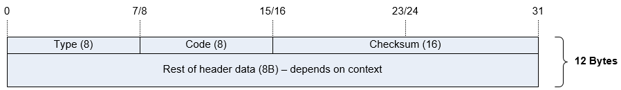

```meta-bind-button
label: Set next review
hidden: false
id: review
style: primary
actions:
  - type: command
    command: review-obsidian:future-review
  - type: input
    str: "next 7 days"
```

# ICMP

- Concept
	- Error message is never send upon receiving another error message
	- ICMP is never sent in reply to broadcast or multicast
	- ICMP is never sent for other IP segments than the first one
	- ICMP is never sent for packets with source IP not being a single host
	- Error messages include original IP header and following first 8B of payload
	- ICMP echo contains an identifier to distinguish between several processes
	- ICMP sends an alphabet as a payload
	- Record Route stores max 9 hops
- Source
	- `(G) ip source <if> icmp-errors`;  Define a source IP for ICMP error messages
- Traceroute
	- Three packets are sent by default
	- TTL is decremented by 1 with each sequence
	- Intermediate hosts send Time Exceeded is TTL is 0 or 1
	- The end host, even if TTL is 1, generates Port Unreachable
	- Windows
		- `tracert`
		- Default is ICMP echo, cannot be changed
	- Linux
		- `traceroute`
		- Default is UDP/33434
		- `-I` - use ICMP
- Unreachable
	- For unreachable message first 32 bits in ICMP payload are unused (all 0)
	- They can be used to define MTU for PMTUD mechanism
	- `(IF) no ip unreachables`; By default enabled. Affects all types of ICMP unreachable messages (traceroute, etc)
- Redirect
	- Redirect contains a gateway IP of router to be used for sending packets
	- Redirects can be generated only by routers, not hosts
	- Routers do not use redirect messages, they use routing table
	- `(IF) no ip redirects`; By default enabled
	- `(G) ip redirect syslog <sec>`; - Enable the syslog for excessive IP redirects; - efault is 60 sec.
---

